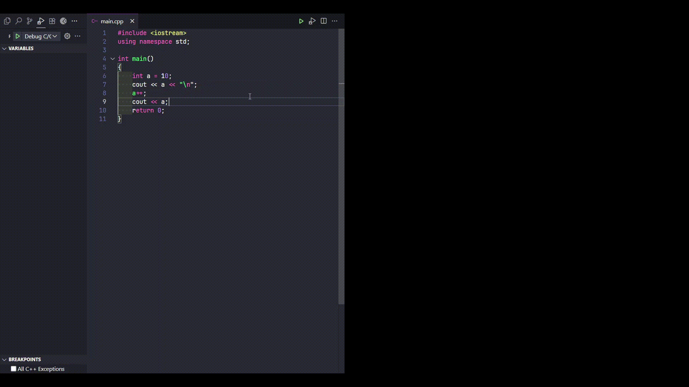

# RunCode C/C++ - README

## Mô tả

Extension **RunCode C/C++** được thiết kế để build và chạy code C/C++ trên Windows. Hỗ trợ biên dịch, chạy, debug trực tiếp trong Visual Studio Code.

## Debug

## Gợi ý/snippets

## Yêu cầu

- Text Editor: **Visual Studio Code**
- Hệ điều hành: **Windows 10** *-v ^1709*

## Cài đặt

1. Mở Visual Studio Code.
2. Nhấn `Ctrl+Shift+X` để mở Extensions.
3. Tìm "RunCode C/C++" và cài đặt.
4. Sau khi cài xong là dùng được luôn.

## Sử dụng

1. Đảm bảo đã cài extension [**C/C++**](https://marketplace.visualstudio.com/items?itemName=ms-vscode.cpptools).
2. Mở file .c hoặc .cpp.
3. Shortcut:
   - **F6**: chạy code
   - **F5**: debug code

## Đóng góp

- Fork repo: [RunCode C/C++](https://github.com/ovfteam/runcode_c_cpp)
- Tạo branch mới: `git checkout -b my-feature`
- Commit thay đổi: `git commit -am 'add new feature'`
- Push lên repo: `git push origin my-feature`
- Tạo pull request trên GitHub

có gì góp ý/bug thì cứ tạo issue hoặc PR nhé.
